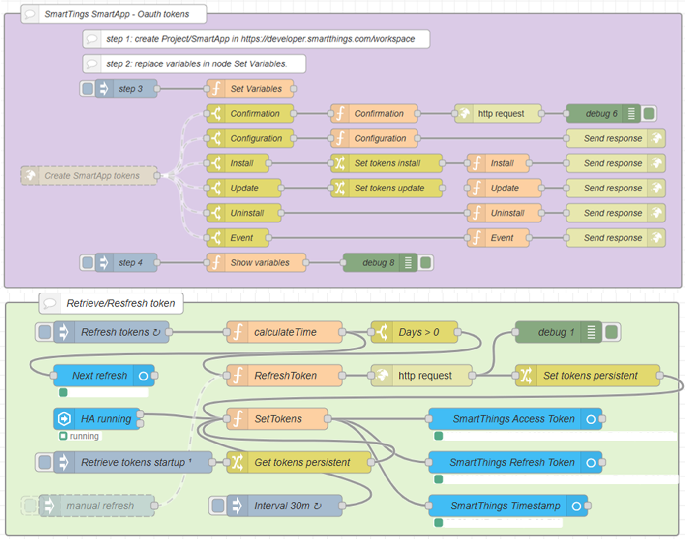

# Node Red - SmartThings

A Node Red flow to daily renew SmartThings access tokens.



## Instructions for installation:

1. Create public https connection Home Assistant [Home Assistant Remote Access for FREE - DuckDNS + LetsEncrypt + Single URL](https://www.youtube.com/watch?v=AK5E2T5tWyM). The redirectURL is: “https://<your_url>:1880/endpoint/smartapp"
1. OPTIONAL: Change the settings.js file (location: /addon_configs/xxxxxxxx_nodered) of Node Red to enable persistent variables, add:
    ```
    contextStorage: {
	    storeInFile: { module: "localfilesystem"},
        default    : { module: "memory" }
    }, 
    ```
    and restart Node Red. Additional information: [A guide to understanding Persistent Context](https://discourse.nodered.org/t/a-guide-to-understanding-persistent-context/4115)
1. Deploy the SmartApp flow in Node Red – import the “smartthings token.json” file in Node Red
1. Create a SmartApp in [SmartThings Developer Workspace](https://developer.smartthings.com/workspace), using the redirectUrl. Write down the App Name, AppID, ClientID, Client Secret.
1. Enter the variables AppName, AppId, ClientId, ClientSecret in Node Red node "Set Variables". Inject via node 'Step 3' to make the vaiables active.
1. Check the redirectUrl in Node Red node "Create SmartApp tokens" (e.g. /smartapp - everything after “https://< create url>:1880/endpoint). 
1. Deploy the SmartApp to test in SmartThings Developer Workspace.
1. Install the SmartApp in the SmartThings App on your mobile phone.
1. You can add a debug node to node "Create SmartApp tokens" to validate if you receive input. When everythings goes well the debug output in Node Red shows the access and refresh tokens which can be used to retrieve daily a new token. They are automatically stored in persistent variables (if step 2 is followed).
1. It's recommended that you manual refresh the access and refresh tokens (only the first time). You can do this by inject the node 'manual refresh'.

## Additonal resources:
* Building SmartApp to receive access and refresh tokens: [Building First SmartApp for Dummies - Developer Programs / Writing SmartApps - SmartThings Community](https://community.smartthings.com/t/building-first-smartapp-for-dummies/251219)
* SmartThings SmartApp Lifecycles: [Lifecycles Developer Documentation SmartThings](https://developer.smartthings.com/docs/connected-services/lifecycles)
* SmartThings API documentation: [API Developer Documentation SmartThings](https://developer.smartthings.com/docs/api/public)
* Refresh token: [Using refresh_token to refresh the API access_token - Developer Programs / Support - SmartThings Community](https://community.smartthings.com/t/using-refresh-token-to-refresh-the-api-access-token/240168)
* Create a SmartThings SmartApp: [Create a SmartThings SmartApp](https://ndiesslin.com/blog/creating-a-smartthings-smartapp-part-1/)