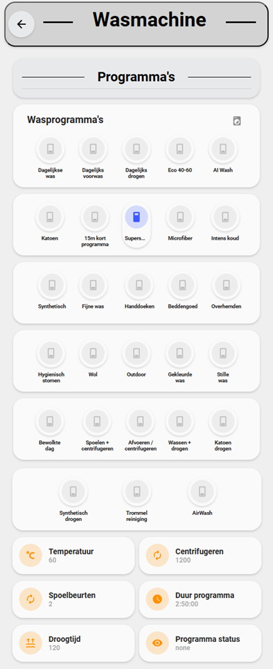
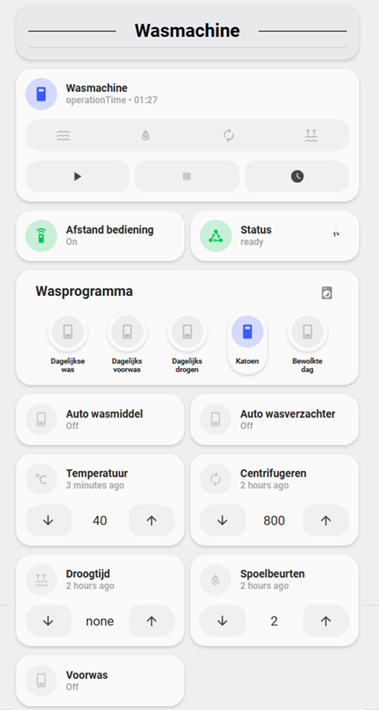

# Samsung SmartThings Washer(/Dryer) project

### The problem
A Samsung washer supports several pre-defined courses. Every course has different default settings and options. Users should only be able to select valid options when starting a washer course. To accomplish this an implementation of a dynamic options list is required which can change based on the selected course.
Applies to: RinseCycle, SpinLevel, SoilLevel (not tested), WaterTemperature, DryLevel

### Additional challenges
* Samsung uses default values for courses which are not part of the supported options (e.g. empty supported options list, default value is “none”).
* Samsung uses values which are not part of the supported options (e.g. course 29 uses temperature “70” which is not part of the option list and can even not be applied via a capability/attribute. It can only be set by the washer by selecting the course).

### The solution (build in Home Assistant Node Red add-on)
1.	When loading the integration [create a list of all courses with the supported options](https://github.com/wilbiev/nodered/blob/main/SmartThings/Washer-dryer/build_option_list.js). The list contains the following items: course name, course type, bubbleSoak supported, optionlist dryLevel, optionlist spinLevel, optionlist soilLevel, optionlist rinseCycles, optionlist waterTemperature. List can be retrieved by a GET request to ‘https://api.smartthings.com/v1/devices/{deviceId}/components/{componentId}/capabilities/{capabilityId}/status’, capabilityId is ‘samsungce.washerCycle’. (Personal note: in my solution the list is refreshed when retrieving a new access token, every 24 hours)
1.	Define HA select entities for dryLevel (if supported), spinLevel, soilLevel (if supported), rinseCycles,  waterTemperature which are required to enable the user select different options for a washer course (e.g. lower washing temperature). Option list of the entities should support all possible options for the device. (Personal note: in my case dryLevel: [‘none’, ‘cupboard’, ‘30’, ‘60’, ‘90’, ‘120’, ‘180’, ‘240’], spinLevel: [‘rinseHold’, ‘noSpin’, ‘400’, ‘800’, ‘1000’, ‘1200’, ‘1400’], soilLevel: [‘extra heavy’, ‘heavy’, ‘normal’, ‘light’, ‘extra light’], rinseCycles: [‘0’, ‘1’, ‘2’, ‘3’, ‘4’, ‘5’], waterTemperature: [‘none’, ‘cold’, ‘20’, ‘30’, ‘40’, ‘60’, ‘70’, ‘90’])
1.	Define HA sensor entities for dryLevel (if supported), spinLevel, soilLevel (if supported), rinseCycles,  waterTemperature which contains the option values from the created list based on the selected course.
1.	Advanced users can [create HA template select entities](https://github.com/wilbiev/nodered/blob/main/SmartThings/Washer-dryer/templates.yaml) for dryLevel (if supported), spinLevel, soilLevel (if supported), rinseCycles,  waterTemperature . These template entities which sync their state with the regular HA select entities, and use the sensor entities as input for the option list. The template select entities are used in the dashboard to select the values (and contain the dynamic option list).

## Findings

### Finishing
The washerOperatingState keeps the state ‘running’ when finishing a course. Sending the command ‘cancel’ (samsungce.washerOperatingState) when the washerJobState is ‘finish’ solves that behavior.

### Refresh / rate limits
My solution includes a subscription to receive all relevant events. On top it retrieves updated information from the API to prevent ‘unknown’ states of the HA entities alive when the washer is not used. Refresh time for washer with remote control disabled is 5 minutes. Refresh time for washer with remote control enabled is 1 hour. The rate of API requests is limited: [Rate Limits and Guardrails | Developer Documentation | SmartThings](https://developer.smartthings.com/docs/getting-started/rate-limits). I experienced a much lower rate limit when using a Personal Access Token (PAT) instead of an OAuth token.

## Additonal resources:
* Building SmartApp to receive access and refresh tokens: [Building First SmartApp for Dummies - Developer Programs / Writing SmartApps - SmartThings Community](https://community.smartthings.com/t/building-first-smartapp-for-dummies/251219)
* SmartThings SmartApp Lifecycles: [Lifecycles Developer Documentation SmartThings](https://developer.smartthings.com/docs/connected-services/lifecycles)
* SmartThings API documentation: [API Developer Documentation SmartThings](https://developer.smartthings.com/docs/api/public)
* Refresh token: [Using refresh_token to refresh the API access_token - Developer Programs / Support - SmartThings Community](https://community.smartthings.com/t/using-refresh-token-to-refresh-the-api-access-token/240168)
* Create a SmartThings SmartApp: [Create a SmartThings SmartApp](https://ndiesslin.com/blog/creating-a-smartthings-smartapp-part-1/)
* SmartThings API device capabilities: https://my.smartthings.com/advanced/devices
* Create PAT-token: SmartThings. Add a little smartness to your things.
* HA SmartThings washer: https://community.home-assistant.io/t/can-smart-samsung-washing-machines-be-started-with-the-smartthings-integration/435701/14
* SmartThings API device capabilities: [SamrtThnigs](https://my.smartthings.com/advanced/devices)
* Create PAT-token: SmartThings. [Add a little smartness to your things.](https://account.smartthings.com/tokens)
* HA SmartThings washer: [Home Assistant Community - Can smart Samsung washing machines be started with the SmartThings integration?](https://community.home-assistant.io/t/can-smart-samsung-washing-machines-be-started-with-the-smartthings-integration/435701/14)

## Home Assistant Dashboards

Dashboards were created in custom HACS integration [UI Lovelace Minimalist](https://github.com/UI-Lovelace-Minimalist/UI).

    
    

